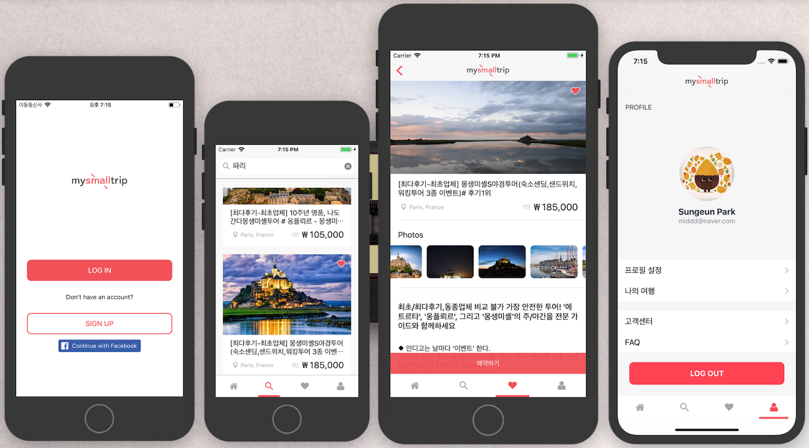

# 마이스몰트립 (MySmallTrip)

> 사진 찍고 오는 여행 No!! 발자국만 찍고 돌고 오는 여행 No!!  
> 진정한 여행이란? 현지를 느끼고 오는 것!!!  
> 현지 여행의 모든 것을 담은 마이리얼트립의 작은 버전. My Small Trip 입니다.

 

## Contents
1. About MySmallTrip
2. About Team
3. Tools

 

## 1. About MySmallTrip
- 기간 : 2018.04.02 ~ 04.25
- 영상 : 
    - 1배속 : https://www.youtube.com/watch?v=xA2IJ0NWzoo&t=8s
    - 2배속 : https://www.youtube.com/watch?v=bwWaEQzDF90

- 마이리얼트립(현재 여행 중개 서비스)의 Small Version
- 서비스의 핵심인 **여행 상품 보여주기 + 예약**에 집중. **UI/UX ReDesign**

 

## 2. About Team
- 팀명 : Oh Team
    - 3개월간 공부한 비전공자들이 만들었다는 게 믿기지 않을 정도의, Oh라는 감탄사가 나올 정도로 대단한 앱을 만들겠다는 의지!
    - 추가 이유는 여러 팀들 중 5조였다는 점..!

- BackEnd (3명) : 유가희, 홍석재 [(GitHub)](https://github.com/OhTeam/Backend)
- iOS (3명)
    - 김용호 [(GitHub)](https://github.com/OhTeam/My_Small_Trip/tree/YH)
    - 박성은 [(GitHub)](https://github.com/OhTeam/My_Small_Trip/tree/SE)
    - 최용석 [(GitHub)](./iOSTeamProject-MySmallTrip/readme/README_YS.md)

 

## 3. Tools
- 공통 : Git, Postman, Slack, Zeplin
- 디자인 : Sketch 3
- iOS : Xcode, Swift, CoCoaPod, Alamofire, Facebook SDK
