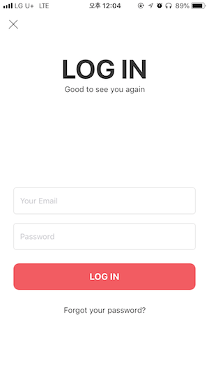

# MySmallTrip

## About
A part of OhTeam's project that has been done by Yongseok Choi 

## Contents
1. [Launch and Root](#launch-and-root)  
2. [Log In](#log-in)  
3. [Profile](#profile)
    - [Photo Change](#profile-photo-change)
    - [Contact Change](#phone-number-change)
    - [Password Change](#password-change)
    - [Log Out](#log-out)
4. [Service Center](#service-center)  

### Launch and Root
<div align="center">
<kbd></kbd>
&nbsp;&nbsp;&nbsp;&nbsp;&nbsp;
<kbd></kbd>
</div>

> ```Launch and Root```  
> On root view user can log into app with 2 ways. The first one is using an email address and the another one is facebook account.  

```swift
// MARK: - Email LogIn
    private func emailTokenLogIn() {
        guard let dic = UserDefaults.standard.object(forKey: "emailUser") as? Dictionary<String, String>,
            let token = dic["token"], token != ""
            else { return }
        
        let logInLink: String = "https://myrealtrip.hongsj.kr/members/info/"
        let header: Dictionary<String, String> = ["Authorization":"Token " + token]
        
        ImportedLibraries.connectionOfSeverForDataWith(logInLink, method: .get, parameters: nil, headers: header, success: { (data, code) in
            if let userLoggedIn = try? JSONDecoder().decode(User.self, from: data) {
                UserData.user.setToken(token: token)
                self.setUserData(userLoggedIn: userLoggedIn)
                print("Automatic email-login succeeded")
                
                self.moveToMainVC()
                
            }
        }) { (error, code) in
            print(error.localizedDescription)
            
            UserData.user.isLoggedIn = false
            
            var tokenAlertVC = UIAlertController(title: "네트워크 오류", message: "네트워크 확인이 필요합니다.", preferredStyle: .alert)
            
            // to catch session expired
            if let code = code {
                switch code {
                case 400..<500:
                    tokenAlertVC = UIAlertController(title: "사용자 인증 만료", message: "사용자 인증이 만료되었습니다.", preferredStyle: .alert)
                default:
                    print(code)
                }
            }
            let okAction = UIAlertAction(title: "확인", style: .default, handler: nil)
            tokenAlertVC.addAction(okAction)
            
            self.present(tokenAlertVC, animated: true)
        }
    }
    
    // MARK: Facebook LogIn
    private func facebookLogIn() {
        let url = UrlData.standards.basic + UrlData.standards.facebookLogin
        
        guard let token = FBSDKAccessToken.current().tokenString else { return }
        let params = ["access_token":token]
        
        ImportedLibraries.connectionOfSeverForDataWith(url, method: .post, parameters: params, headers: nil, success: { (data, code) in
            do {
                let userData = try JSONDecoder().decode(EmailLogIn.self, from: data)
                self.setUserData(userLoggedIn: userData)
                print("Automatic facebook-login succeeded")
                
                self.moveToMainVC()
                
            } catch(let error) {
                print("\n---------- [ JSON Decoder error ] -----------\n")
                print(error)
            }
        }) { (error, code) in
            print("\n---------- [ Alamofire request error ] -----------\n")
            print(error.localizedDescription)
        }
    }
```
> Needs to import external libraries like Facebook and Alamofire in every file if the code which is in the libraries are used. It is very simple to use the code, just import the libraries in every source file where necessary but if then the speed to read code when app is run must get slow. So the libraries needed to gather in the same file as a internal libraries in order to make speed up.  
> In this project Facebook and Alamofire libraries is imported so these external libraries have been gathered in the one file.  
```swift
import Foundation
import Alamofire
import FBSDKCoreKit
import FBSDKLoginKit

// MARK: - Classes
class ImportedLibraries {
    // -----------------------------> Alamofire
    static func connectionOfSeverForDataWith(_ url: URLConvertible, method: HTTPMethod, parameters: Parameters?, headers: HTTPHeaders?, success: @escaping (_ data: Data, _ code: Int?) -> Void, failure: @escaping (_ error: Error, _ code: Int?) -> ()) {
        
        Alamofire.request(url, method: method, parameters: parameters, headers: headers).validate().responseData { (response) in
            switch response.result {
            case .success(let data):
                success(data, response.response?.statusCode)
            case .failure(let error):
                failure(error, response.response?.statusCode)
            }
        }
    }
    
    static func connectionOfServerForJSONWith(_ url: URLConvertible, method: HTTPMethod, parameters: Parameters?, headers: HTTPHeaders?, success: @escaping (_ data: Any, _ code: Int?) -> Void, failure: @escaping (_ error: Error, _ code: Int?) -> ()) {
        
        Alamofire.request(url, method: method, parameters: parameters, headers: headers).validate().responseJSON { (response) in
            switch response.result {
            case .success(let any):
                success(any, response.response?.statusCode)
            case .failure(let error):
                failure(error, response.response?.statusCode)
            }
        }
    }
    
    static func uploadOntoServer(multipartFormData: @ escaping (MultipartFormData) -> Void, usingThreshold: UInt64, to: URLConvertible, method: HTTPMethod, headers: HTTPHeaders?, encodingFailure: @escaping (_ error: Error) -> (), success: @escaping (_ data: Data, _ code: Int?) -> Void, failure: @escaping (_ error: Error, _ code: Int?) -> Void) {
        
        Alamofire.upload(multipartFormData: multipartFormData, usingThreshold: usingThreshold, to: to, method: method, headers: headers, encodingCompletion: { (result) in
            switch result {
            case .success(let request, _, _):
                request.responseData(completionHandler: { (response) in
                    switch response.result {
                    case .success(let data):
                        success(data, response.response?.statusCode)
                    case.failure(let error):
                        failure(error, response.response?.statusCode)
                    }
                })
            case .failure(let error):
                encodingFailure(error)
            }
        })
    }
    
    // -----------------------------> Facebook
    
    static func FacebookAppDelegateShareInstance(_ application: UIApplication, didFinishLaunchingWithOptions launchOptions: [UIApplicationLaunchOptionsKey: Any]?) {
        FBSDKApplicationDelegate.sharedInstance().application(application, didFinishLaunchingWithOptions: launchOptions)
    }
    
    static func FacebookAppDelegateShareInstance(_ app: UIApplication, open url: URL, options: [UIApplicationOpenURLOptionsKey : Any] = [:]) -> Bool {
        let handled = FBSDKApplicationDelegate.sharedInstance().application(app, open: url, sourceApplication: options[UIApplicationOpenURLOptionsKey.sourceApplication] as! String, annotation: options[UIApplicationOpenURLOptionsKey.annotation])
        
        return handled
    }
    
    class FacebookLogInButton: FBSDKLoginButton {
        
    }
    
    class FacebookLogInManager: FBSDKLoginManager {
        
    }
    
    class FacebooLogInManagerResult: FBSDKLoginManagerLoginResult {
        
    }
    
    static func FacebookAccessTokenString() -> String! {
        return FBSDKAccessToken.current().tokenString
    }
    
    static func FacebookAccessToken() -> FBSDKAccessToken! {
        return FBSDKAccessToken.current()
    }
}

// MARK: - Protocols
// -----------------------------> Facebook
protocol FacebookLogInBtnDelegate: FBSDKLoginButtonDelegate {
    
}
```

> If the app was successfully logged in before, automatically the app will be logged in when users touch the app even though app is terminated due to this code.

```swift
// in UserData
var isLoggedIn: Bool {
        set {
            self._isLoggedIn = newValue
        }
        get {
            return _isLoggedIn
        }
    }

private var _isLoggedIn: Bool = false {
        willSet {
            if newValue == false {
                self.setToken(token: nil)
                self.setPrimaryKey(primaryKey: nil)
                self.setUserName(userName: nil)
                self.setEmail(email: nil)
                self.setFirstName(firstName: nil)
                self.setPhoneNumber(phoneNumber: nil)
                self.setIsFacebookUser(isFacebookUser: nil)
                self.setImgProfile(imgProfile: nil)
                self.setProfileImgData(profileImgData: nil)
                self.setWishListPrimaryKeys(wishListPrimaryKeys: Array<Int>())
            }
        }
    } // Boolean value if logged in

func setToken(token: String?) {
        if let token = token {
            self._token = token
            self.userDic.updateValue(token, forKey: "token")
            UserDefaults.standard.set(self.userDic, forKey: "emailUser")
        } else {
            self.userDic.updateValue("", forKey: "token")
            UserDefaults.standard.set(self.userDic, forKey: "emailUser")
        }
    }
```

<br>
<br>
<br>
<br>

### Log In
<div align="center">
<kbd></kbd>
</div>

> Login Main

<br>
<br>
<br>
<br>

<div align="center">
<kbd></kbd>
&nbsp;&nbsp;&nbsp;&nbsp;
<kbd></kbd>
</div>

> Login Error  
> If user types a wrong information on the email or pw box, this app notifies it.

<br>
<br>
<br>
<br>

### Profile
<div align="center">
<kbd></kbd>
&nbsp;&nbsp;&nbsp;&nbsp;
<kbd></kbd>
</div>

> Profile  

<br>
<br>
<br>
<br>

### Profile Photo Change
<div align="center">
<kbd></kbd>
&nbsp;&nbsp;&nbsp;&nbsp;
<kbd></kbd>
</div>

<div align="center">
<kbd></kbd>
</div>

> Profile Photo Change  
> User can change their profile with any photo which they want using camera and album in iPhone as well.  
> If the network is in error (server or network error), the profile photo cannot be changed.  

<br>
<br>
<br>
<br>

### Phone Number Change
<div align="center">
<kbd></kbd>
</div>
<div align="center">
<kbd></kbd>
&nbsp;&nbsp;&nbsp;&nbsp;
<kbd></kbd>
</div>
<div align="center">
<kbd></kbd>
&nbsp;&nbsp;&nbsp;&nbsp;
<kbd></kbd>
</div>

> Phone Number Change  
> User can change their phone number with authentication.

<br>
<br>
<br>
<br>

### Password Change
<div align="center">
<kbd></kbd>
</div>
<div align="center">
<kbd></kbd>
&nbsp;&nbsp;&nbsp;&nbsp;
<kbd></kbd>
</div>
<div align="center">
<kbd></kbd>
&nbsp;&nbsp;&nbsp;&nbsp;
<kbd></kbd>
</div>
<div align="center">
<kbd></kbd>
&nbsp;&nbsp;&nbsp;&nbsp;
<kbd></kbd>
</div>
<div align="center">
<kbd></kbd>
&nbsp;&nbsp;&nbsp;&nbsp;
<kbd></kbd>
</div>
<div align="center">
<kbd></kbd>
</div>

> Password Change  
> If users want to change the pw after login to app, they should pass 8 conditions as follows.  

```swift
// MARK: - Verify Password
    private func verifyPW() -> Bool {
        guard let firstPWTextField = firstPWTextField,
            let secondPWTextFiedld = secondPWTextField
            else { return false }
      
        var isVerified: Bool = false
        let password = Password(firstPW: firstPWTextField.text!, secondPW: secondPWTextFiedld.text!)
        
        // first condition
        if firstPWTextField.text! == "" || password.isBlank {
            notiString = "아무것도 입력되지 않았거나 모두 빈칸입니다"
            popUpFailureNotiLabels(false)
            
        } else if !password.isSameAsSecondPW {
            notiString = "변경을 원하는 비밀번호와 재입력된 비밀번호가 다릅니다."
            popUpFailureNotiLabels(false)
            
        } else if !password.isOverEightCharacters {
            notiString = "비밀번호는 여덟글자 이상 작성되어야 합니다."
            popUpFailureNotiLabels(false)
            
        } else if password.hasBlank {
            notiString = "비밀번호에 빈칸은 포함되지 않습니다."
            popUpFailureNotiLabels(false)
            
        } else if password.hasOnlyNumber {
            notiString = "비밀번호는 숫자로만 구성되지 않습니다."
            popUpFailureNotiLabels(false)
            
        } else if !password.hasUppercase {
            notiString = "비밀번호에 영 대문자가 포함되지 않았습니다."
            popUpFailureNotiLabels(false)
            
        } else if !password.hasLowercase {
            notiString = "비밀번호에 영 소문자가 포함되지 않았습니다."
            popUpFailureNotiLabels(false)
            
        } else if !password.hasSpecialCharacter {
            notiString = "비밀번호에 특수문자가 포함되지 않았습니다."
            popUpFailureNotiLabels(false)
            
        } else if !password.hasNumber {
            notiString = "비밀번호에 숫자가 포함되지 않았습니다."
            popUpFailureNotiLabels(false)
            
        } else {
            isVerified = true
            popUpFailureNotiLabels(true)
        }
        
        return isVerified
    }
```
> This method uses the instance from Password class as follows.

```swift
class Password {
    
    // The passwords to be inputted
    private let firstPW: String
    private let secondPW: String
    
    init(firstPW: String, secondPW: String) {
        self.firstPW = firstPW
        self.secondPW = secondPW
    }
    
    // Verify if blank is the password
    var isBlank: Bool {
        var isBlankString: Bool = true
        
        for char in self.firstPW {
            if char != " " {
                isBlankString = false
            }
        }
        
        return isBlankString
    }
    
    // Verify the both password are same
    var isSameAsSecondPW: Bool {
        if self.firstPW == self.secondPW {
            return true
        } else {
            return false
        }
    }
    
    // Verify the number of password characters is over 8
    var isOverEightCharacters: Bool {
        if self.firstPW.count >= 8 {
            return true
        } else {
            return false
        }
    }
    
    // Verify If the blank exists in the password
    var hasBlank: Bool {
        if self.firstPW.contains(" ") {
            return true
        } else {
            return false
        }
    }
    
    // Verify if only the number exists in the password
    var hasOnlyNumber: Bool {
        var isNumberString: Bool = true
        let pwArray: Array<Character> = Array<Character>(self.firstPW)
        
        for char in pwArray {
            if !(char == "1" || char == "2" || char == "3" || char == "4" || char == "5" || char == "6" || char == "7" || char == "8" || char == "9" || char == "0" ) {
                isNumberString = false
            }
        }
        
        return isNumberString
    }
    
    // Verify if the capital letter limited exists in the password
    var hasUppercase: Bool {
        let uppercaseLetters: String = "ABCDEFGHIJKLMNOPQRSTUVWXYZ"
        
        return compare(self.firstPW, with: uppercaseLetters)
    }
    
    // Verify if the capital letter limited exists in the password
    var hasLowercase: Bool {
        let lowerLetters: String = "abcdefghijklmnopqrstuvwxyz"
        
        return compare(self.firstPW, with: lowerLetters)
    }
    
    // Verify if the special character exists in the password
    var hasSpecialCharacter: Bool {
        var isSpecialCharacter: Bool = false
        let commonCharacters: String = "ABCDEFGHIJKLMNOPQRSTUVWXYZabcdefghijklmnopqrstuvwxyz1234567890"
        let password: Array<Character> = Array<Character>(self.firstPW)
        
        for char in password {
            if !compare(commonCharacters, with: String(char)) {
                isSpecialCharacter = true
                break
            }
        }
        
        return isSpecialCharacter
    }
    
    // Verify if the number exists in the password
    var hasNumber: Bool {
        let numbers: String = "1234567890"
        
        return compare(self.firstPW, with: numbers)
    }
    
    // Compare password with some letters    
    private func compare(_ object: String, with: String) -> Bool {
        var hasSpecificCharacter: Bool = false
        let objectString: Array<Character> = Array<Character>(object)
        let comparedString: Array<Character> = Array<Character>(with)
        
        firstLoop : for obj in objectString {
            for cmp in comparedString {
                if obj == cmp {
                    hasSpecificCharacter = true
                    break firstLoop
                }
            }
        }
        
        return hasSpecificCharacter
    }
}
```

<br>
<br>
<br>
<br>

### Log Out
<div align="center">
<kbd></kbd>
</div>

> Log Out 
> If some problem happens like network error, user can see this notification. Whatever the app must be logged out.

<br>
<br>
<br>
<br>

### Service Center
<div align="center">
<kbd></kbd>
</div>

> Service Center  
> User can contact to service center with phone call or email.

```swift
@objc private func touchFirstView(_ sender: UIButton) {
        // Animation of Button
        UIView.animate(withDuration: 0.2, animations: {
            self.firstView!.backgroundColor = UIColor(displayP3Red: 147/255, green: 147/255, blue: 147/255, alpha: 0.3)
        }) { (bool) in
            self.firstView!.backgroundColor = UIColor(displayP3Red: 1, green: 1, blue: 1, alpha: 1)
            
            let callURL = URL(string: "tel://1661-2860")!
            if UIApplication.shared.canOpenURL(callURL) {
                UIApplication.shared.open(callURL)
            }
        }
    }
    
    @objc private func touchSecondView(_ sender: UIButton) {
        // Animation of Button
        UIView.animate(withDuration: 0.2, animations: {
            self.secondView!.backgroundColor = UIColor(displayP3Red: 147/255, green: 147/255, blue: 147/255, alpha: 0.3)
        }) { (bool) in
            self.secondView!.backgroundColor = UIColor(displayP3Red: 1, green: 1, blue: 1, alpha: 1)
            
            let mailURL = URL(string: "mailto://help@mysmalltrip.com")!
            if UIApplication.shared.canOpenURL(mailURL) {
                UIApplication.shared.open(mailURL)
            }
        }
    }
```

<br>
<br>
<br>
<br>

## Source Files
> [Yongseok Choi Part](https://github.com/OhTeam/My_Small_Trip/tree/YS)  
> [OhTeam](https://github.com/OhTeam/My_Small_Trip)

## Contact
> Email: clyksb0731@gmail.com  
> LinkedIn: https://www.linkedin.com/in/yongseok-choi-24b647153/